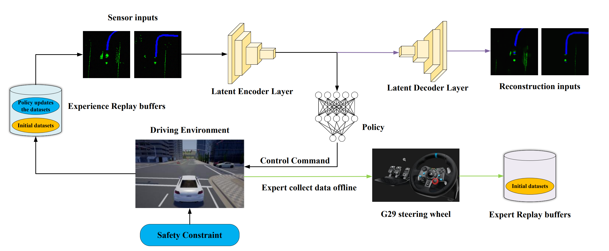

[SGADS: Safe and Generalized end-to-end Autonomous Driving System with Reinforcement Learning and Demonstrations](https://arxiv.org/abs/2401.11792)
======

Zuojin Tang 1 2 Xiaoyu Chen 3 Yongqiang Li 4 Jianyu Chen 1 3 
1 Shanghai Qizhi Institute
2 College of Computer Science and Technology, Zhejiang University 
3 Institute for Interdisciplinary Information Sciences, Tsinghua University 
4 Neolix

 
 
##  Overview of the Safe and Generalized end-to-end Autonomous Driving with Reinforcement Learning and Demonstrations. 

## [Project pages](https://sites.google.com/view/sgads-proj/sgads)
